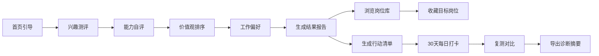

## 1. 产品概述

面向职场新人和准备跳槽人群的职业适配分析 Web 应用，通过多维度测评帮助用户发现职业方向、匹配岗位、规划行动路径。

- 核心价值：基于兴趣、能力、价值观、工作偏好四大维度的科学测评，输出个性化职业诊断报告
- 目标用户：0-5 年职场新人、职业转型者、跳槽决策人群
- 市场定位：轻量级职业规划工具，填补职业测评与求职行动之间的断层

## 2. 核心功能

### 2.1 用户角色

| 角色 | 注册方式 | 核心权限 |
|------|----------|----------|
| 普通用户 | 无需注册，本地存储 | 完成测评、查看报告、浏览岗位库、管理行动清单、查看历史记录、导出摘要 |

### 2.2 功能模块

1. **诊断问卷页**：兴趣测评、能力自评、价值观排序、工作偏好选择
2. **结果报告页**：职业类型标签雷达图、匹配岗位排序、维度分析
3. **岗位库页**：岗位列表筛选、薪资区间对比、成长空间、岗位日常说明、收藏功能
4. **行动清单页**：能力差距清单、30天行动计划、执行状态打卡
5. **历史记录页**：历次测评记录、复测对比、诊断摘要导出

### 2.3 页面详情

| 页面名称 | 模块名称 | 功能描述 |
|----------|----------|----------|
| 诊断问卷页 | 欢迎引导 | 介绍测评流程、预计时长、开始测评按钮 |
| 诊断问卷页 | 兴趣测评 | 8 道 Likert 五级量表题，测评六大兴趣维度 |
| 诊断问卷页 | 能力自评 | 8 道题，自评六大核心能力水平 |
| 诊断问卷页 | 价值观排序 | 拖拽 6 项职业价值观排序 |
| 诊断问卷页 | 工作偏好 | 6 道情景选择题，评估工作环境偏好 |
| 诊断问卷页 | 进度指示器 | 顶部显示当前测评阶段与进度 |
| 结果报告页 | 职业画像卡片 | 展示用户职业类型标签与综合描述 |
| 结果报告页 | 多维雷达图 | 可视化展示四大维度得分 |
| 结果报告页 | 匹配岗位列表 | 按匹配度排序展示 Top 10 推荐岗位 |
| 结果报告页 | 维度分析 | 文字解读各维度高分/低分含义 |
| 岗位库页 | 筛选搜索栏 | 按行业、薪资、经验要求筛选，关键词搜索 |
| 岗位库页 | 岗位卡片 | 展示岗位名称、匹配度、薪资区间、标签、收藏按钮 |
| 岗位库页 | 岗位详情弹窗 | 日常工作描述、能力要求、成长路径、薪资分布 |
| 岗位库页 | 薪资对比视图 | 选中多岗位横向对比薪资与成长空间 |
| 行动清单页 | 能力差距分析 | 对比目标岗位要求与自评能力，标记差距项 |
| 行动清单页 | 30天计划生成器 | 根据差距自动生成每日行动建议，支持自定义编辑 |
| 行动清单页 | 打卡执行面板 | 每日任务清单、完成状态切换、进度条 |
| 历史记录页 | 测评时间线 | 卡片式展示历次测评的时间与职业类型 |
| 历史记录页 | 复测对比视图 | 雷达图叠加对比两次测评变化，文字解读变化 |
| 历史记录页 | 摘要导出 | 生成可分享的 PNG/PDF 诊断摘要卡片 |

## 3. 核心流程

用户进入应用 → 浏览欢迎引导 → 开始诊断问卷 → 依次完成兴趣/能力/价值观/偏好测评 → 提交后生成报告 → 查看职业画像与匹配岗位 → 进入岗位库浏览详情并收藏目标岗位 → 生成能力差距与 30天行动计划 → 每日执行打卡 → 复测后对比变化 → 导出诊断摘要分享。

## 4. 用户界面设计

### 4.1 设计风格

- **主色**：深夜蓝 `#1E293B`（专业、可信赖），配暖阳橙 `#F59E0B`（活力、正向）
- **辅助色**：薄荷绿 `#10B981`（成长、积极）、玫瑰红 `#F43F5E`（警示、差距）
- **中性色**：纸白 `#FAF9F6`、暖灰系列，营造杂志编辑感
- **按钮风格**：圆角胶囊型，主按钮带微阴影与悬浮抬升动效
- **字体**：标题用 `Playfair Display`（衬线编辑感），正文用 `DM Sans`（现代无衬线）
- **布局风格**：卡片式布局 + 大量留白，非对称栅格，关键数据使用大号字体突出
- **图标风格**：Lucide 线性图标，统一 24px，圆角端点
- **背景细节**：纸纹噪点叠加、微妙渐变晕染、几何装饰线条

### 4.2 页面设计概览

| 页面名称 | 模块名称 | UI 元素 |
|----------|----------|----------|
| 诊断问卷页 | 欢迎引导 | 大号衬线标题、分步骤时间线、CTA 按钮悬浮动画 |
| 诊断问卷页 | 答题区 | 左侧进度条、右侧卡片式题目、选项 hover 放大、淡入切换 |
| 结果报告页 | 职业画像 | 大号标签徽章、雷达图渐变色填充、数字滚动动画 |
| 结果报告页 | 岗位推荐 | 匹配度进度条渐变色、卡片进入 stagger 动画 |
| 岗位库页 | 筛选栏 | 胶囊型筛选标签、搜索框聚焦发光效果 |
| 岗位库页 | 岗位详情 | 弹窗缩放进入、分栏布局、薪资柱状图 |
| 行动清单页 | 差距分析 | 双栏能力对比、差距项用红色标识带图标 |
| 行动清单页 | 打卡面板 | 日历视图网格、完成项打勾动画、进度条环形 |
| 历史记录页 | 时间线 | 垂直时间线、卡片点击展开、对比雷达图叠加 |
| 历史记录页 | 导出卡片 | 精美摘要卡片预览、下载按钮带文件图标 |

### 4.3 响应式设计

- 桌面端优先设计（1280px+）
- 平板端（768-1024px）：栅格列数自适应收缩
- 移动端（< 768px）：单列布局、底部导航栏、触摸友好的大按钮

### 4.4 动效设计

- 页面切换：左滑淡入过渡 300ms
- 数据加载：骨架屏 pulse 动画
- 按钮交互：hover 抬升 2px + 阴影加深，click 回弹
- 图表出现：从 0 开始绘制动画 800ms ease-out
- 卡片悬停：轻微缩放 + 边框高亮
