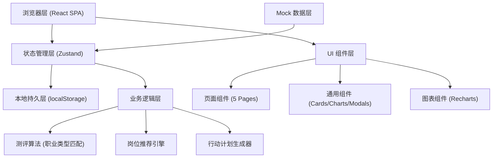
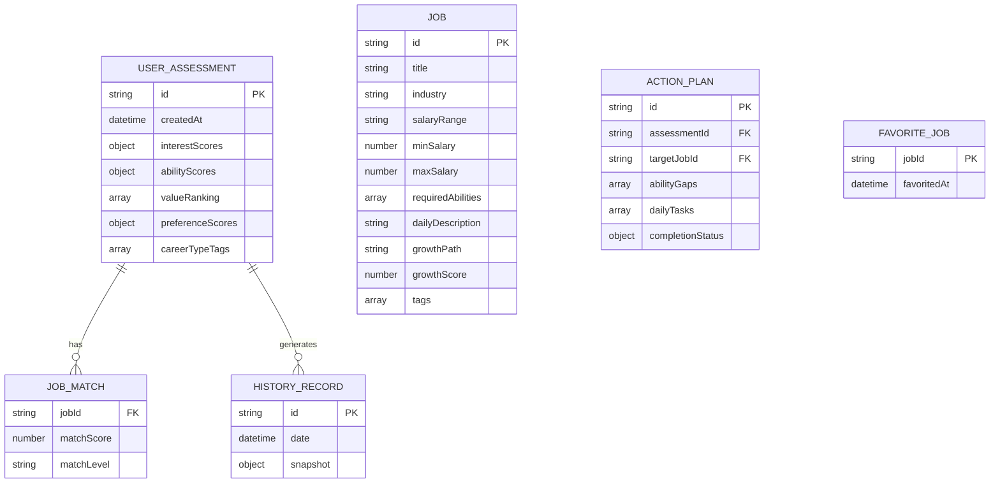

## 1. 架构设计



## 2. 技术栈说明

- **前端框架**：React@18 + TypeScript@5 + Vite@5
- **样式方案**：TailwindCSS@3 + 自定义设计令牌
- **状态管理**：Zustand@4（含 persist 中间件本地持久化）
- **路由方案**：React Router DOM@6
- **图标库**：Lucide React
- **图表库**：Recharts@2（雷达图、柱状图、进度图）
- **后端**：无后端，纯前端 SPA，数据本地持久化
- **数据库**：localStorage + 内置 Mock 数据
- **导出功能**：html2canvas（PNG 导出）

## 3. 路由定义

| 路由 | 用途 |
|------|------|
| `/` | 诊断问卷首页（欢迎引导 + 测评流程） |
| `/report` | 结果报告页（职业画像 + 匹配岗位） |
| `/jobs` | 岗位库页（筛选 + 详情 + 收藏 + 对比） |
| `/action` | 行动清单页（差距分析 + 30天计划 + 打卡） |
| `/history` | 历史记录页（时间线 + 复测对比 + 导出） |

## 4. 数据模型

### 4.1 实体关系图



### 4.2 核心类型定义

```typescript
// 测评维度分数
interface DimensionScores {
  realistic: number;      // 现实型
  investigative: number;  // 研究型
  artistic: number;       // 艺术型
  social: number;         // 社会型
  enterprising: number;   // 企业型
  conventional: number;   // 常规型
}

// 能力自评分数
interface AbilityScores {
  analytical: number;     // 分析能力
  creative: number;       // 创造力
  communication: number;  // 沟通能力
  leadership: number;     // 领导力
  technical: number;      // 技术能力
  emotional: number;      // 情商
}

// 职业价值观
type CareerValue = 
  | 'achievement'     // 成就满足
  | 'stability'       // 稳定安全
  | 'creativity'      // 创造自由
  | 'wealth'          // 经济报酬
  | 'impact'          // 社会影响
  | 'balance';        // 工作生活平衡

// 岗位信息
interface Job {
  id: string;
  title: string;
  industry: string;
  salaryRange: string;
  minSalary: number;
  maxSalary: number;
  requiredAbilities: Partial<AbilityScores>;
  dailyDescription: string;
  growthPath: string[];
  growthScore: number;     // 1-5 成长空间评分
  tags: string[];
  matchDimensions: Partial<DimensionScores>;
}

// 用户测评完整记录
interface Assessment {
  id: string;
  createdAt: string;
  interest: DimensionScores;
  ability: AbilityScores;
  values: CareerValue[];
  preferences: Record<string, number>;
  careerTypes: { type: CareerValue; score: number }[];
}

// 行动任务
interface DailyTask {
  id: string;
  day: number;             // 第几天 (1-30)
  title: string;
  description: string;
  category: 'learn' | 'practice' | 'network' | 'reflect';
  completed: boolean;
}

// 能力差距项
interface AbilityGap {
  ability: keyof AbilityScores;
  current: number;
  required: number;
  gap: number;
  priority: 'high' | 'medium' | 'low';
}
```

## 5. 状态管理结构

```typescript
// Zustand Store 切片
interface CareerStore {
  // 测评状态
  currentStep: number;           // 0-5 问卷步骤
  answers: Record<string, any>;  // 当前填写的答案
  currentAssessment: Assessment | null;

  // 岗位数据
  jobs: Job[];
  favoriteJobIds: string[];
  selectedJobIds: string[];      // 用于对比

  // 行动清单
  abilityGaps: AbilityGap[];
  dailyTasks: DailyTask[];
  targetJobId: string | null;

  // 历史记录
  history: Assessment[];

  // Actions
  setAnswer: (qid: string, value: any) => void;
  submitAssessment: () => void;
  toggleFavorite: (jobId: string) => void;
  toggleCompare: (jobId: string) => void;
  generateActionPlan: (jobId: string) => void;
  toggleTaskComplete: (taskId: string) => void;
  getMatchedJobs: () => (Job & { matchScore: number })[];
  clearAll: () => void;
}
```

## 6. 目录结构

```
src/
├── components/           # 通用组件
│   ├── ui/              # 基础 UI (Button, Card, Modal, Progress)
│   ├── charts/          # 图表组件 (RadarChart, SalaryBar)
│   ├── assessment/      # 问卷相关组件
│   ├── jobs/            # 岗位相关组件
│   └── action/          # 行动清单组件
├── pages/               # 页面组件
│   ├── AssessmentPage.tsx
│   ├── ReportPage.tsx
│   ├── JobsPage.tsx
│   ├── ActionPage.tsx
│   └── HistoryPage.tsx
├── store/               # Zustand 状态管理
│   └── useCareerStore.ts
├── data/                # Mock 数据
│   ├── questions.ts     # 测评题库
│   └── jobs.ts          # 岗位库
├── utils/               # 工具函数
│   ├── matching.ts      # 岗位匹配算法
│   ├── planGenerator.ts # 行动计划生成
│   └── export.ts        # 导出工具
├── types/               # TypeScript 类型定义
│   └── index.ts
├── App.tsx
├── main.tsx
└── index.css
```
